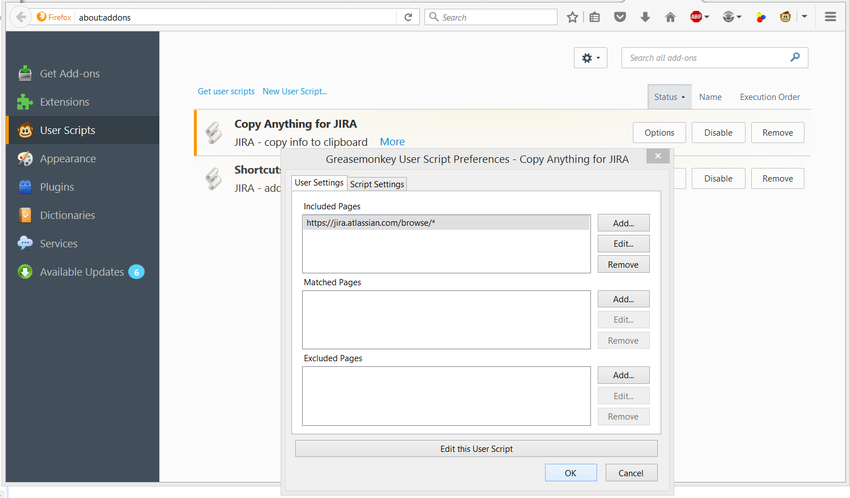
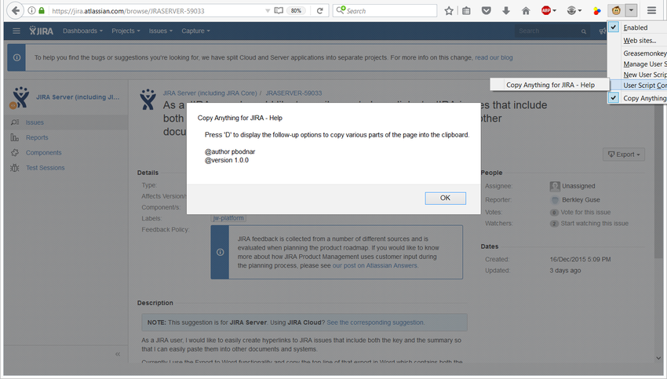
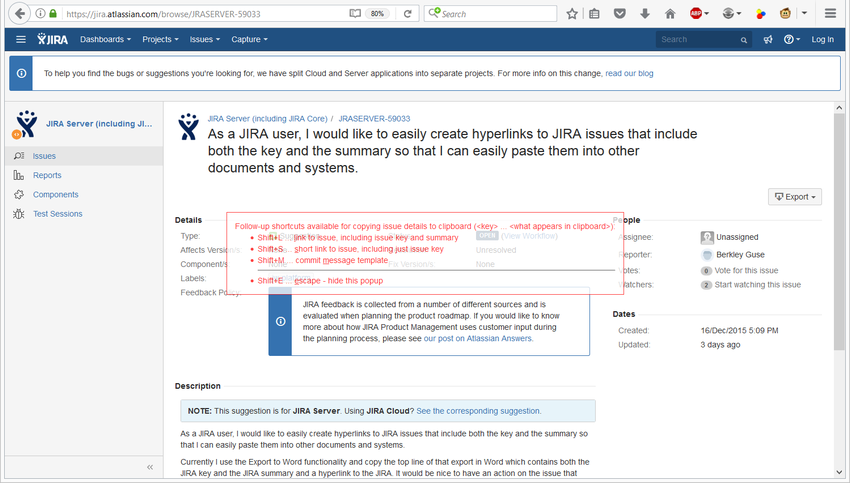
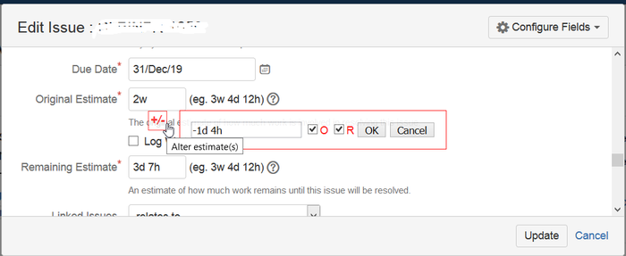

# About

This project contains various handy user scripts for the [Greasemonkey](https://addons.mozilla.org/en-US/firefox/addon/greasemonkey/) (for Firefox; GM) and [Tampermonkey](https://chrome.google.com/webstore/detail/dhdgffkkebhmkfjojejmpbldmpobfkfo) (for Chrome; TM) browser addons. A user script is a piece of JavaScript code which gets executed on page load and which extends functionality of the pages it was written for. 

# Installation

Firstly install the aforementioned addon for your favorite browser and then simply open the selected *\*.user.js* file in the browser. GM (or TM) will guide you through the rest of the user script installation. The most important thing to do is to set up the pages for which you want to have the given user script activated. You can always find an example of the appropriate "include pattern" right in the installed user script.

An example configuration:

# Usage

The usage is always specific to a given user script. Most user scripts should offer a special help dialog that can be opened via the GM / TM toolbar icon. And of course, you can always look into the script's source code and see what it actually does... :)

An example help dialog:

An example of the JIRA_copy user script in action (the red "overlay" is rendered by the script after the user presses a corresponding shortcut):

One of the JIRA_shotcuts user script functions in action:

# Troubleshooting

What if something is not working as expected? Then you should firstly try to find some relevant information or error messages in the console log - this is typically available by pressing F12 in your browser and by navigating to the "Console" tab. And select for example "Logging -> Log" to see detailed logging from the GM scripts in Firefox.

If you find a bug or a missing feature, you can create a new issue for that on the "Issues" page of this Github project.

# For developers

This special chapter includes tips for those who would like to develop GM / TM scripts. 

## Run GM Scripts on Local Disk Files

Set the following on the "about:config" page in Firefox:

    greasemonkey.fileIsGreaseable: true

See http://stackoverflow.com/questions/9931115/run-greasemonkey-on-html-files-located-on-the-local-filesystem

## Force GM to Run Script in Sandbox

At least some `@grant <> 'none'` must be present in the user script's header in order to force GM to run the script 'in sandbox'.

See http://stackoverflow.com/questions/12146445/jquery-in-greasemonkey-1-0-conflicts-with-websites-using-jquery
